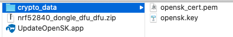
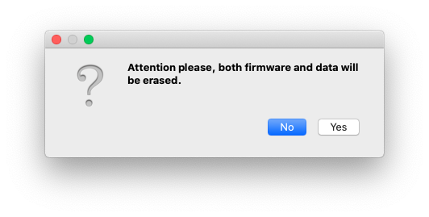
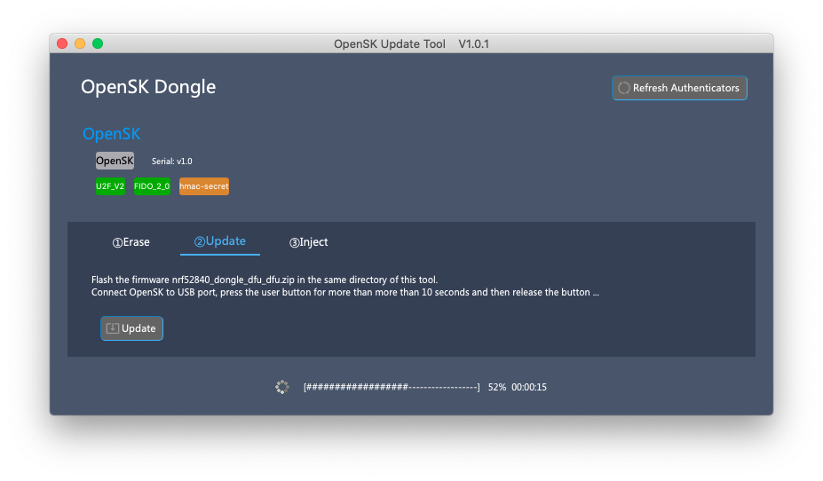

## Background
After Feitian OpenSK USB Dongle was released, the official OpenSK github firmware source code has been updated for many times, and the update seems to be frequent. So there is request from user to update the firmware.  
[Google OpenSK github repository](https://github.com/google/opensk "OpenSK") provides [official steps](https://github.com/google/OpenSK/blob/stable/docs/install.md "installation guide") to update the firmware. But to end users who are not familiar with development, it is very hard for them to setup the development environment, install several tools, clone and build the source code, and run command line tool to update. So Feitian developped this GUI tool for user to simply update the firmware.

## Open Source
This tool is open source software, anyone can review the source code from [OpenSK Update Tool Github Repository](https://github.com/FeitianTech/OpenSKUpdateTool/releases "OpenSK Update Tool") .  
Feitian will build the firmware from official [Google OpenSK github repository](https://github.com/google/opensk "OpenSK") aperiodically, and list the binary firmware on [Feitian OpenSK Repository](https://github.com/FeitianTech/OpenSK/releases "OpenSK Firmware"). User can choose the firmware version they like and re-program the OpenSK USB dongle directly without extra work.

## Guide
Here show how to use the OpenSK GUI Update Tool to update firmware on macOS. The steps and UI are similar on other platforms (Windows, Linux).  
Please refer to [hardware description page](./hardware.md) to learn how to switch the OpenSK USB dongle to bootloader mode.

### 1. Download tool and files
You can download the tool and from [OpenSK Update Tool Github Repository](https://github.com/FeitianTech/OpenSKUpdateTool/releases "OpenSK Update Tool") .  
You can download firmware and attestation cryptographic material from [Feitian OpenSK Repository](https://github.com/FeitianTech/OpenSK/releases "OpenSK Firmware").  
!!! note "NOTE"
	The crypto materials downloaded here were pre-generated just to show how to use the firmware update tool. To keep the hardware security and privacy, OpenSK dongle sold publicly uses different crypto materials.  
	You can generate your own crypto materials.
After you download the firmware and attestation cryptographic material, put them into the same directory of this update tool like below picture showed.  

### 2. Launch Update Tool
Insert your OpenSK USB Dongle to your USB port, no matter whether it is in Bootloader mode or not.
Launch this tool, it shows as below picture.  

### 3. Erase Storage (Optional)
If you want to keep your existing Credentials or your OpenSK USB dongle works well after you upgrade the firmware, you can skip this step.

This step is optional, used to [clear all storage](https://github.com/google/OpenSK/pull/247 "OpenSK") (include firmware and all data) if you meet some issues after you update firmware, for example, incompatible storage version.

To try this step, choose first "Erase" Tab, insert your OpenSK USB Dongle to your USB port, press the user button on hardware for more than 10 seconds to switch your OpenSK USB Dongle to bootloader mode, then click "Erase" button, confirm the question as below dialog shows, wait for this operation to be successfully performed.

After this step, the OpenSK USB Dongle will not be recognized by this tool as normal, you can switch it to bootloader mode and perform the next step.

### 4. Update Firmware
Please make sure you have downloaded firmware nrf52840_dongle_dfu_dfu.zip package to the same directory of this tool.  
To perform this step, choose second "Update" Tab, insert your OpenSK USB Dongle to your USB port, press the user button on hardware for more than 10 seconds to switch your OpenSK USB Dongle to bootloader mode, then click "Update" button, wait for the firmware to be 100% flashed.

### 5. Inject Attestation Certificate and Private Key
The last step is to inject the cryptographic material if you enabled batch attestation or CTAP1/U2F compatibility (which is the case by default), otherwise, it can not work well.

Choose third "Inject" Tab, attach your OpenSK USB Dongle to your USB port, click "Inject" button on this page. The user button of the OpenSK will flash, press the user button to agree, success status message will be showed quickly.

Now you can test you OpenSK USB Dongle according to [Test Page](./test.md).