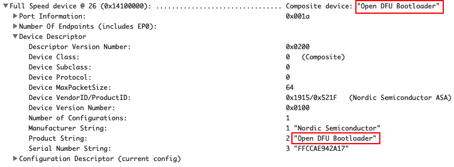

# Overview

We have two types of OpenSK, V1 and V2.  They have almost same schematic but different casing.  
Currently, only **V2** is available to the market.

-----
## OpenSK V2
  

It has a metal housing with only one button in the aft area.  

!!! note "NOTE"
    The LED and User button are together. The button material is transparent, so user can see LED light through the button.  
    Since the LED is behind the button, you have to check it from the **aft area** to find it breathing or flashing.
    
### 1. Switch To bootloader mode
After user connects the device to a computer, **push and hold on** the user button for ^^**==more than 10 seconds==**^^ and then ^^**==release==**^^ the button. If the red LED is ^^**==breathing==**^^, OpenSK is in bootloader mode.  

### 2. LED status
| LED behavior |  Mode type | Trigger Method |
| :-- | :-- | :-- |
| Red LED is ^^**==breathing==**^^ | bootloader mode | Connect OpenSK to USB port, press the user button for more than ^^**==more than 10 seconds==**^^ and then ^^**==release==**^^ the button  |
| Red LED is flashing | bootloader mode | Flash the firmware |
| No LED on | Working mode | Idle |
| R/G/B LED is flashing | Working mode | Wait for user presence when receiving FIDO command |  

### 3. Hardware
The hardware schematic and PCB are shared [here](hardware_files/OpenSK_V2.zip). 

-----
## OpenSK V1
  

It has a 3D-printed case with one user button and one RESET button.

### 1. Switch To bootloader mode
After connecting OpenSK to the USB port, please insert a paper clip or a SIM-eject tool to the RESET button hole to switch it to bootloader mode. This is similar to user pushes the [RESET button](https://infocenter.nordicsemi.com/index.jsp?topic=%2Fug_nrf52840_dongle%2FUG%2Fnrf52840_Dongle%2Fprogramming.html) on the original nRF52840 USB dongle.  

!!! note "NOTE"
    The RESET button hole is covered by OpenSK label. So if you want to program the firmware occasionally, you can choose not to cover the label although we send the label to you together with OpenSK hardware.

### 2. LED status
| LED behavior |  Mode type | Trigger Method |
| :-- | :-- | :-- |
| Blue LED is breathing | bootloader mode | Use a paper clip or a SIM-eject tool to push RESET button in RESET button hole |
| Blue LED is flashing | bootloader mode | Flashing the firmware |
| No LED on | Working mode | Idle |
| R/G/B LED is flashing | Working mode | Wait for user presence when receiving FIDO command |

### 3. Hardware
The hardware schematic and PCB files can be downloaded [here](hardware_files/OpenSK_V1.zip). 

##Check Bootloader Mode
Sometimes, maybe you don't know whether your OpenSK is in bootloader mode after above operation, you can
have three ways to check.

###1. LED breathing
If the ^^**==red==**^^ LED is ^^**==breathing==**^^, OpenSK is in bootloader mode, this is the simplest way.

###2. lsusb command
On Linux or macOS, just run 
``` 
$ lsusb
```  
to see the result.  
(Plesae make sure you have this command installed previously.)  

If there is line similar to below message(1915:521f & Nordic & ^^**==Open DFU Bootloader==**^^)
```
Bus 020 Device 026: ID 1915:521f Nordic Semiconductor ASA Open DFU Bootloader  Serial: FFCCAE942A17
```
then it is in ^^**==bootloader==**^^ mode.
Other message line without ^^**==Open DFU Bootloader==**^^ but include 1915:521f and Nordic means it is in normal working mode.

###3. USB Prober.app
On macOS, if you have USB Prober.app installed, run this app. If you have OpenSK attached and it is in bootloader mode, you should find USB information similar to below picture.


  
This means it is in bootloader mode.
