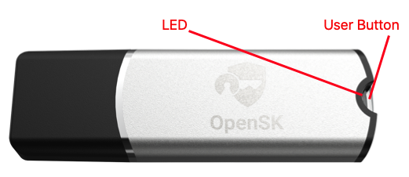

# Overview

We have two types of OpenSK, V1 and V2.  They have almost same schematic but different casing.

-----
## OpenSK V1

### 1. Switch To DFU mode
After connect OpenSK to USB port, please insert a paper clip or a SIM-eject tool to the RESET button hole to switch it to DFU mode. This is similar as user push the RESET button on original nRF52840 USB dongle.  

!!! note "NOTE"
    RESET button hole is covered by OpenSK label. So if you want to program the firmware occasionally, you can choose not to cover the label although we send the label to you together with OpenSK hardware.

### 2. LED status
| LED behaviour |  Mode type | Triger Method |
| :-- | :-- | :-- |
| Blue LED is breathing | DFU mode | Use a paper clip or a SIM-eject tool to push RESET button in RESET button hole |
| Blue LED is flashing | DFU mode | Flashing the firmware |
| No LED on | Working mode | Idle |
| R/G/B LED is flashing | Working mode | Wait for user presence when receiving FIDO command |

### 3. Hardware
The hardawre schematic and PCB files can be downloaded [here](hardware_files/OpenSK_V1.zip). 

-----
## OpenSK V2

!!! note "NOTE"
    The LED and User button are together. The button material is transparent, so user can see LED light through the button.
    
### 1. Switch To DFU mode
after user connect the device to computer, user should push and hold on the user button for more than 8 seconds, then OpenSK will be in DFU mode.  

### 2. LED status
| LED behaviour |  Mode type | Triger Method |
| :-- | :-- | :-- |
| Red LED is breathing | DFU mode | Use a paper clip or a SIM-eject tool to push RESET button in RESET button hole |
| Red LED is flashing | DFU mode | Flashing the firmware |
| No LED on | Working mode | Idle |
| R/G/B LED is flashing | Working mode | Wait for user presence when receiving FIDO command |
### 3. Hardware
The hardawre schematic and PCB are shared [here](hardware_files/OpenSK_V2.zip). 

